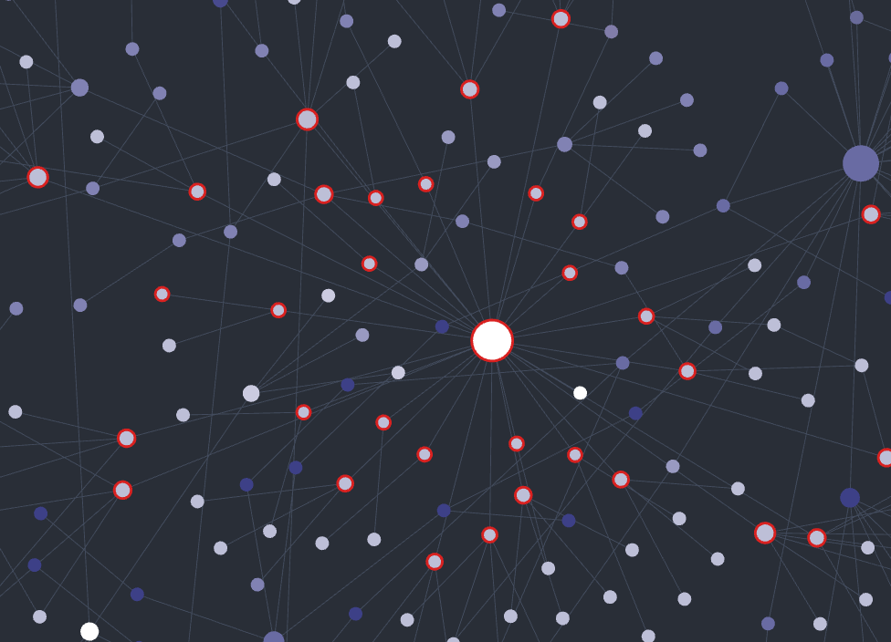

# Graph Type to Search

An Obsidian plugin that brings **type-ahead search** to the **graph view**. Just start typing while the graph is focused — no need to press `Cmd/Ctrl+F` or click into a search box first. Matching nodes get a **highlight ring**, and by default the whole graph stays on screen so you keep the surrounding context (you can switch to filtering instead).

## Why this plugin exists

Obsidian's built-in graph search filters live as you type, but only *after* you focus its search box. This plugin removes that step and adds a visible **ring around matching nodes** so they stand out at a glance — optionally without hiding the rest of the graph, when you want to keep the surrounding context.

## How it works

While a graph (or local graph) pane is active, the plugin shows a small **bar pinned to the top-left** and keeps it focused for you. Just start typing — anything you enter (including **IME composition for Hangul / CJK**, Backspace, and text selection) goes natively into the bar.

As the query changes, the plugin draws a **hollow highlight ring** around every node whose **title contains the query**. The ring is drawn into the graph's own renderer (the same approach as the *Graph Unread Highlight* plugin), so it tracks pan, zoom and the simulation automatically, sits just outside each node, and never changes node colors or color groups.

By default the entire graph **stays on screen** and only the matches are ringed, so you keep the surrounding context. Turn off **Keep all nodes visible** to instead push the query into the graph's built-in search, **hiding non-matching nodes** (the surviving matches keep their ring).

Using a real, focused, **visible** input is what makes **Korean and other IME input compose correctly**: you can't redirect a composition that began while another element had focus, and a hidden host would draw the composition caret at its off-screen corner instead of where the text is. After you pan or click in the graph, focus is handed back to the bar on pointer-up so the next keystroke goes straight into the query.

## Settings

- **Ring color** — color of the highlight ring (color picker; defaults to a vivid pink).
- **Ring gap** — how far the ring sits outside the node.
- **Ring thickness** — width of the ring stroke.
- **Highlighted label size** — size multiplier for matching node titles (1.0 = no change).
- **Keep all nodes visible** — don't hide non-matching nodes; keep the whole graph and only ring the matches (on by default). Turn off to filter the graph as you type instead.
- **Enable in local graph** — also show the bar and highlight in the local graph pane (on by default).

## Notes

This plugin draws into the graph view's internal renderer (PIXI) and uses its internal search component, neither of which is part of the public plugin API; they may change in future Obsidian versions. It is desktop-only.

## License

[MIT](LICENSE)
